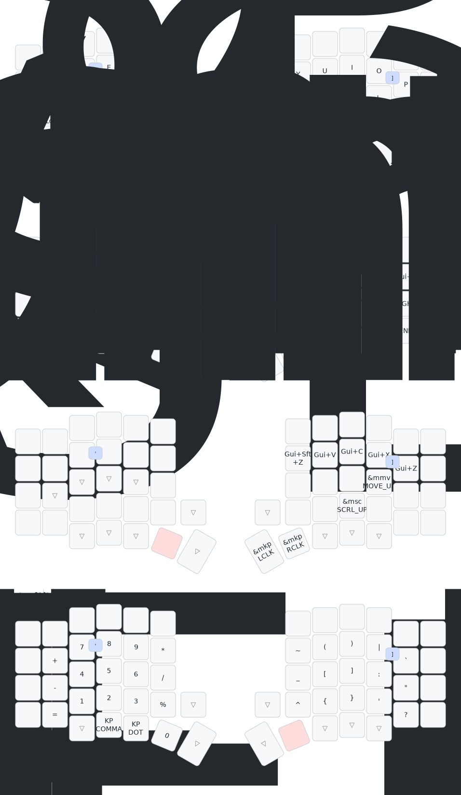

# ⌨️ Sofle ZMK Config

## 🛠 macOS System Tweaks (Keylayouts)
ZMK отправляет скан-код клавиши, а операционная система решает, какой символ вывести на экран.
Стандартные раскладки macOS меняют положение символов (`@`, `#`, `^`, `&`) при смене языка.
Мои кастомные раскладки **фиксируют знаки препинания на одних и тех же физических кнопках**, независимо от выбранного языка (EN или RU).
Например, `Shift + 2` — это всегда `@`, даже в русской раскладке.

В папке `keylayouts/`:
* **sofle-en** (`ID: 35350`)
* **sofle-ru** (`ID: 35351`)

## 🚀 Инструкция по установке

1. Копируем раскладки в систему 
    ```bash cp keylayouts/*.keylayout ~/Library/Keyboard\ Layouts/```

2. Бекап перед изменением системы 
   ```bash cp ~/Library/Preferences/com.apple.HIToolbox.plist ~/Library/Preferences/com.apple.HIToolbox.plist.bak```

3. Добавляем новые раскладки прямо в конфиг HIToolbox
    ```bash
    defaults write ~/Library/Preferences/com.apple.HIToolbox AppleEnabledInputSources -array \
      '{"InputSourceKind" = "Keyboard Layout"; "KeyboardLayout ID" = 35350; "KeyboardLayout Name" = "sofle-en"; }' \
      '{"InputSourceKind" = "Keyboard Layout"; "KeyboardLayout ID" = 35351; "KeyboardLayout Name" = "sofle-ru"; }' \
      '{"Bundle ID" = "com.apple.CharacterPaletteIM"; InputSourceKind = "Non Keyboard Input Method"; }'
      ```

4. Изменения вступят в силу только после перезагрузки системы. Выход из учетной записи (Log out) может не сработать.
5. После перезагрузки убедитесь, что настройки применились:
    ```bash
    defaults read ~/Library/Preferences/com.apple.HIToolbox AppleEnabledInputSources
    ```

---

- Построена на базе **[Miryoku](https://github.com/manna-harbour/miryoku/tree/master/docs/reference)**, но адаптирована под физическую раскладку Sofle.
- Обновить схему локально `./draw.sh`

## ✨ Актуальная схема слоев

<p align="center">
  
</p>
