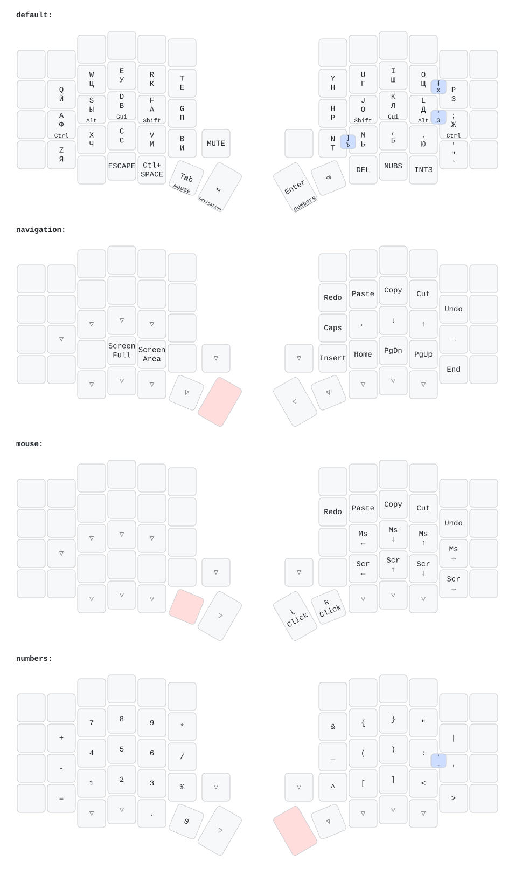

# ⌨️ Sofle ZMK Config (40-key Layout)

Этот репозиторий превращает классическую **Sofle (58 клавиш + 2 энкодера)** в компактную **40-клавишную** клавиатуру (layout 3x5 + 5 клавиш большого пальца). Остальные клавиши отключены.

## 🎯 Философия и Цели

За основу была взята идеология **[Miryoku](https://github.com/manna-harbour/miryoku)** (минимализм, использование слоев, home row mods), но адаптирована под физическую геометрию Sofle и специфические требования:

1.  **Радикальный даунгрейд:** Отказ от верхнего ряда цифр и боковых колонок в пользу минимизации движений пальцев.
2.  **Агностицизм к языку ввода:** Главная боль стандартных клавиатур — "уезжающие" символы при смене языка (например, `;` превращается в `ж`, а `[` в `х`). Решение: Все спецсимволы для кодинга (`[]`, `{}`, `<>`, `&`, `|` и др.) жестко прибиты к одним и тем же физическим клавишам. Неважно, активен у вас сейчас **English** или **Russian** — нажатие на скобку всегда напечатает скобку.
3.  **Единая экосистема:** Это работает благодаря связке прошивки ZMK и кастомных системных раскладок macOS.

---

## 🛠 Техническая реализация (macOS Tweaks)

Одной прошивки ZMK недостаточно, так как ОС сама интерпретирует скан-коды. Чтобы реализовать независимость символов от языка, я переписал системные таблицы соответствия клавиш (`.keylayout`).

**Как это работает:**
1.  **ZMK (Слой NUM/SYM):** Отправляет комбинацию `Option + Клавиша`.
2.  **macOS (.keylayout):** Перехватывает эту комбинацию через кастомный слой Option и выдает нужный символ (например, `Option + M` = `[`), игнорируя стандартную логику языка.

### Файлы раскладок
Лежат в папке `keylayouts/`:
* **sofle-en** (`ID: 35350`) — Базовая английская.
* **sofle-ru** (`ID: 35351`) — Русская, с хаком для спецсимволов и починенными шорткатами (CMD работает как в EN).

---

## 🚀 Инструкция по установке

Для корректной работы необходимо установить кастомные раскладки в macOS.

**1. Копируем раскладки в систему**
```bash
cp keylayouts/*.keylayout ~/Library/Keyboard\ Layouts/
```

**2. Бекап перед изменением системы** 
```bash 
cp ~/Library/Preferences/com.apple.HIToolbox.plist ~/Library/Preferences/com.apple.HIToolbox.plist.bak
```

**3. Жесткая активация через HIToolbox** 
Добавляем раскладки напрямую в конфиг, так как macOS агрессивно кэширует настройки и может не увидеть изменения через GUI.
```bash
defaults write ~/Library/Preferences/com.apple.HIToolbox AppleEnabledInputSources -array \
  '{"InputSourceKind" = "Keyboard Layout"; "KeyboardLayout ID" = 35350; "KeyboardLayout Name" = "sofle-en"; }' \
  '{"InputSourceKind" = "Keyboard Layout"; "KeyboardLayout ID" = 35351; "KeyboardLayout Name" = "sofle-ru"; }' \
  '{"Bundle ID" = "com.apple.CharacterPaletteIM"; InputSourceKind = "Non Keyboard Input Method"; }'
```

**4. Перезагрузка**
Изменения вступят в силу только после перезагрузки системы. Выход из учетной записи (Log out) часто не помогает обновить кэш демона ввода.

**5. Проверка** После перезагрузки убедитесь, что в списке источников ввода появились кастомные раскладки:
```bash
defaults read ~/Library/Preferences/com.apple.HIToolbox AppleEnabledInputSources
```

## ✨ Актуальная схема слоев
Для генерации схемы используется keymap-drawer. Чтобы обновить картинку локально, запустите `./draw.sh`

<p align="center">
  
</p>
